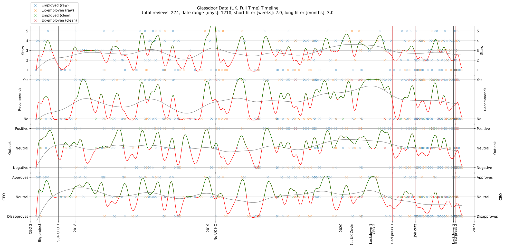

# Glassdoor Data (UK, Full Time)

## 2017-09-01 to 2021-01-01

### 5 Stars
12% total
- 11% technical
- 14% non-technical
- 12% employed
- 13% ex-employee

### 1 Star
35% total
- 33% technical
- 38% non-technical
- 33% employed
- 39% ex-employee

### Recommend
42% total
- 45% technical
- 38% non-technical
- 43% employed
- 39% ex-employee

### Positive Outlook
36% total
- 39% technical
- 31% non-technical
- 36% employed
- 36% ex-employee

### Negative Outlook
36% total
- 38% technical
- 35% non-technical
- 37% employed
- 35% ex-employee

### Approve CEO 2
18% total
- 15% technical
- 20% non-technical
- 21% employed
- 11% ex-employee

### Disapprove CEO 2
14% total
- 13% technical
- 14% non-technical
- 11% employed
- 20% ex-employee

### Approve CEO 3
4% total
- 5% technical
- 4% non-technical
- 4% employed
- 5% ex-employee

### Disapprove CEO 3
22% total
- 27% technical
- 16% non-technical
- 27% employed
- 10% ex-employee

