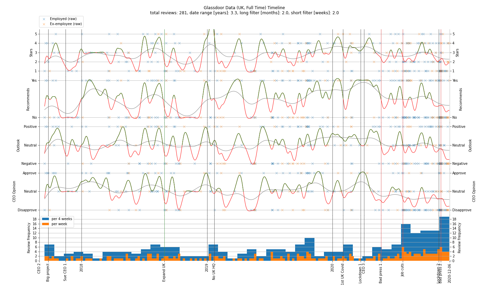

# Glassdoor Data (UK, Full Time)

## 2016-06-23 to 2021-01-01

Statistic|Total|Technical|Non-technical|Employed|Ex-employee
-|-|-|-|-|-
5 Stars|13%|11%|16%|14%|12%
1 Star|30%|29%|30%|27%|36%
Recommend|44%|46%|46%|49%|32%
Positive Outlook|35%|37%|34%|39%|27%
Negative Outlook|31%|33%|30%|31%|32%
Approve CEO 2|13%|11%|13%|15%|8%
Disapprove CEO 2|10%|10%|9%|8%|14%
Approve CEO 3|3%|3%|5%|3%|4%
Disapprove CEO 3|16%|20%|15%|20%|7%

